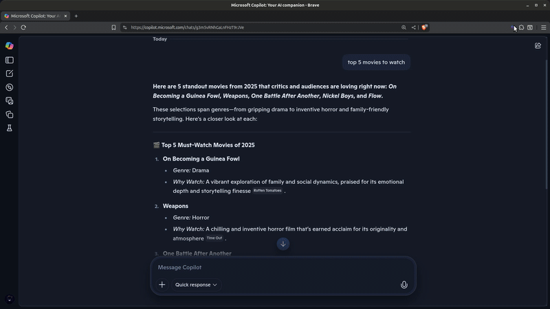
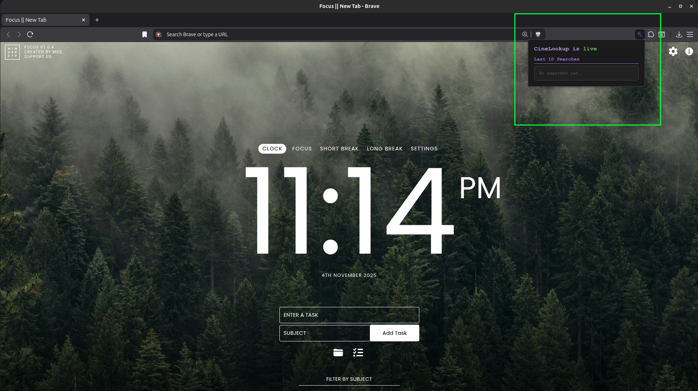
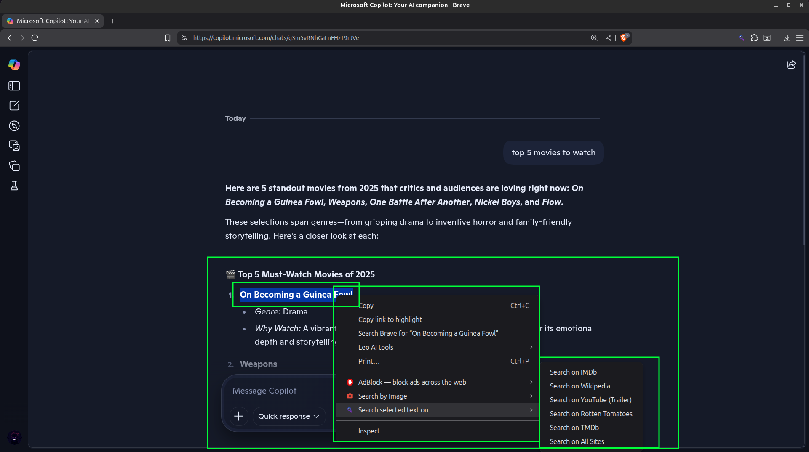

# 🎬 CineLookup

**CineLookup** is a minimalist Chrome extension that lets you search selected movie or TV titles across multiple sites — IMDb, Wikipedia, YouTube, Rotten Tomatoes, and TMDb — all from a single context menu.

## 🚀 Features

- 🔍 Right-click selected text to search across 5+ movie info sites
- 🧠 “Search All” option opens tabs for every site at once
- 📋 Automatically copies selected text to clipboard
- ⚡ Fast, lightweight, and privacy-respecting
- 🎨 Clean, distraction-free UI with purple accent branding

## 📸 Demo

## 🖼️ Screenshots

| Context Menu | Sub Menu | Clipboard Copy |
|--------------|-------------|----------------|
|  |  |  |

## 🛠️ Installation

You can install CineLookup in two ways:

### Option 1: From the Chrome Web Store
- Search for **CineLookup** in the [Chrome Web Store](https://chrome.google.com/webstore)
- Click **Add to Chrome** to install instantly

### Option 2: Manual Installation (for developers)
1. Clone or download this repo
2. Go to `chrome://extensions` in your browser
3. Enable **Developer Mode** (top right)
4. Click **Load unpacked** and select the `cine-lookup` folder

## 🧠 Author

Built by **UmbraDomini** — passionate about privacy-first tools, minimalist design, and practical automation.

> CineLookup is open-source and designed to be genuinely useful. Feedback, forks, and stars are welcome!

---

